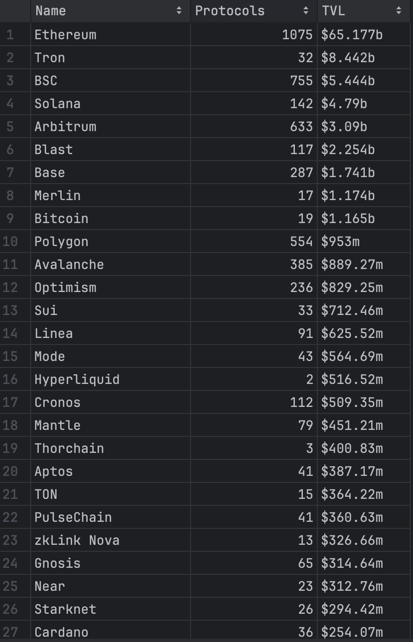

# DeFi Llama Chains Scraper

This repository contains a script to scrape data from DeFi Llama's chains page and store it in a CSV file. The script uses Selenium for web scraping and supports configurable proxy settings and scraping intervals.

## Detailed Instructions for Setup and Execution

### 1. Set Up the Scraping Environment

1. **Clone the repository**:
    ```sh
    git clone https://github.com/juliastetsko/defillama-scraper.git
    ```

2. **Create a virtual environment**:
    ```sh
    python -m venv venv
    source venv/bin/activate  # On Windows, use `venv\Scripts\activate`
    ```

3. **Install the required packages**:
    ```sh
    pip install -r requirements.txt
    ```

4. **Set up environment variables**:
    Create a `.env` file in the project directory with the following content:
    ```env
    INTERVAL=300
    PROXY=http://yourproxy:port  # Replace with your actual proxy URL and port if needed
    ```

### 2. Configure Proxy Settings and Intervals for Data Collection

- **INTERVAL**: The interval, in seconds, at which the script will re-run to scrape data. Default is set to 300 seconds (5 minutes).
- **PROXY**: The proxy server URL. If you do not need a proxy, you can leave this variable empty or remove it from the `.env` file.

### 3. Execute the Script

1. **Run the script**:
    ```sh
    python scraper.py
    ```

   This will start the scraping process and create a file named `defillama.csv` with the scraped data.

2. **Schedule the script to run at the defined intervals**:
    The script is configured to run periodically based on the `INTERVAL` setting. It uses the `schedule` library to achieve this.

3. **Logging**:
    The script logs its activities and any errors to `scraper.log` for debugging and monitoring purposes.

By following these instructions, you should be able to set up and run the DeFi Llama Chains Scraper successfully. For any issues or contributions, feel free to create a pull request or open an issue in the repository.


## Example of csv

